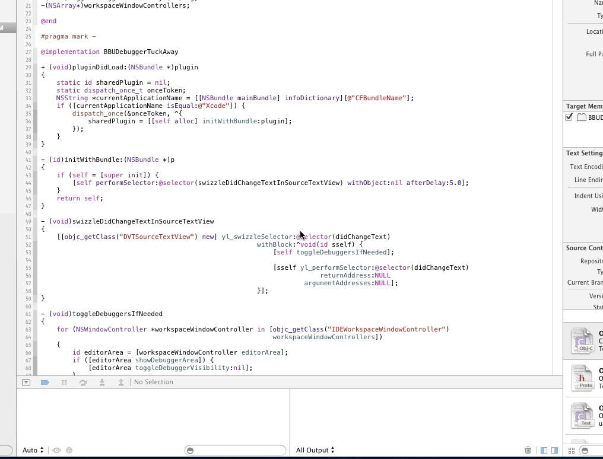

# Extending Xcode

## CocoaHeads Hamburg, April 2014

### Boris Bügling - @NeoNacho

---

---

# Agenda

- Xcode
- Use plugins
- Develop your own plugin

---

# AppCode?

.

---

# Xcode

---

Plugins!

---

# Possibilities

- Color Schemes
- File Templates
- Project Templates
- Plugins

---

# Use Plugins

---

### How do I even...

---

@_supermarin

---

## Alcatraz

The Xcode package manager

http://alcatraz.io

Marin, Delisa and Jurre

---

*curl -fsSL https://raw.github.com/supermarin/Alcatraz/master/Scripts/install.sh | sh*

---

opens

---

### How does it work?

- *packages.json* contains GitHub URL
- Clones the repository
- Runs *xcodebuild* with some parameters

---

# Some cool plugins

---

### ClangFormat

---

### FuzzyAutoComplete

---

### KSImageNamed

---

### OMColorSense

---

### ShowInGithub

---

### VVDocumenter-Xcode

---

### Xcode\_beginning\_of\_line

---

### XcodeColors

---

# Develop your own plugin

---

# Getting started

- Clone *https://github.com/kattrali/Xcode5-Plugin-Template*
- Put it into *~/Library/Developer/Xcode/Templates/Project Templates/Application Plug-in/Xcode5 Plugin.xctemplate*

---

---

# Plugin Template

- Xcode 5.1 compatible
- Shows a menu item
- On build, plugin ends up here: *~/Library/Application Support/Developer/Shared/Xcode/Plug-ins/*
- Just restart and it shows up

---

### Once you build and restart Xcode

.

---

---

### Let's build something useful...

.

---

# General points

---

# Compatibility UUIDs

### This might appear in your *system.log*

    [MT] PluginLoading: Required plug-in compatibility UUID 640F884E-CE55-4B40-87C0-8869546CAB7A
    for plug-in at path '~/Library/Application Support/Developer/Shared/Xcode/Plug-ins/CocoaPodsPlugIn.xcplugin'
    not present in DVTPlugInCompatibilityUUIDs

    $ defaults read /Applications/Xcode51-DP2.app/Contents/Info DVTPlugInCompatibilityUUID
    640F884E-CE55-4B40-87C0-8869546CAB7A

### Add that UUID to your plugin's *Info.plist*

---

### This will happen all the time

---

# Your only friends...

    $ tail -f /var/log/system.log

    $ rm -rf ~/Library/Application Support/Developer/Shared/Xcode/Plug-ins/*

- Debug from the command line with *lldb*...
- or with a second instance of Xcode

---

# Headers

Use *class-dump* yourself, or just grab
https://github.com/luisobo/Xcode5-RuntimeHeaders

---

# What we are looking for

- How to detect if the user types in the editor?
- How to hide the debug pane?

---

`grep -ri editor *`

---

    @interface IDEWorkspaceWindowController : NSWindowController
          <NSWindowDelegate,
           IDEEditorAreaContainer,
           DVTStatefulObject,
           DVTTabbedWindowControlling,
           DVTEditor,
           DVTInvalidation>

    [...]

    @property(readonly) IDEEditorArea *editorArea;

    [...]

    @end

---

    @interface IDEEditorArea : IDEViewController <IDEDebuggerBarEditorInfoProvider>

    [...]

    - (void)toggleDebuggerVisibility:(id)arg1;
    - (void)activateConsole:(id)arg1;
    @property BOOL showDebuggerArea;

    [...]

    @end

---

    - (void)toggleDebuggersIfNeeded {
      for (NSWindowController *workspaceWindowController in
            [objc_getClass("IDEWorkspaceWindowController")
              workspaceWindowControllers]) {
        id editorArea = [workspaceWindowController editorArea];
        if ([editorArea showDebuggerArea]) {
            [editorArea toggleDebuggerVisibility:nil];
        }
      }
    }

---

    @interface NSObject (ShutUpWarnings)

    -(id)editorArea;
    -(BOOL)showDebuggerArea;
    -(void)toggleDebuggerVisibility:(id)arg;
    -(NSArray*)workspaceWindowControllers;

    @end

---

# Grepping through _subtreeDescription

^ Logged view hierarchy under IDEWorkspaceWindowController

`grep -i source *`

    [   AF O P LU ] h=--- v=--- NSClipView 0x7f822e93e990 f=(35,0,885,662) b=(0,637,-,-)
      TIME drawRect: min/mean/max 0.00/0.00/0.00 ms
    [   AF O   LU ] h=-&- v=-&- DVTSourceTextView 0x7f822c723f00 f=(0,0,885,1339) b=(-)
      TIME drawRect: min/mean/max 0.00/0.00/0.00 ms
    [   A      LU ] h=--- v=--- DVTMessageBubbleView 0x7f822eb5c080 f=(638,975,247,12) b=(-)
      TIME drawRect: min/mean/max 0.23/0.42/0.68 ms

---

DVTSourceTextView

---

    - (void)swizzleDidChangeTextInSourceTextView {
        [[objc_getClass("DVTSourceTextView") new]
            yl_swizzleSelector:@selector(didChangeText)
                     withBlock:^void(id sself) {
                       [self toggleDebuggersIfNeeded];

                       [sself yl_performSelector:@selector(didChangeText)
                                   returnAddress:NULL
                               argumentAddresses:NULL];
                      }];
    }

---

---

---

    @interface NSObject (YOLO)

    -(void)yl_performSelector:(SEL)aSelector
                returnAddress:(void *)result
            argumentAddresses:(void *)arg1, ...;
    -(void)yl_swizzleSelector:(SEL)originalSelector
                    withBlock:(id)block;

    @end

---

---

# Ship it

    {
      "name": "My Life-Changing Xcode Plugin",
      "url": "https://github.com/me/xcode-life-changing-plugin",
      "description": "Makes Xcode stop, collaborate and listen."
    }

Send a pull request to the Alcatraz packages repo

https://github.com/supermarin/alcatraz-packages

---

# Using DTrace

- Powerful dynamic tracing framework
- Can be used to log any objc_msgSend()
- Useful for seeing call trees of a specific class
- http://chen.do/blog/2013/10/22/reverse-engineering-xcode-with-dtrace/

---

https://github.com/kattrali/xcode-devtools
https://coderwall.com/p/-mgtww

---

alcatraz.io

---

https://github.com/neonichu/extending-xcode/
https://github.com/neonichu/BBUDebuggerTuckAway/

