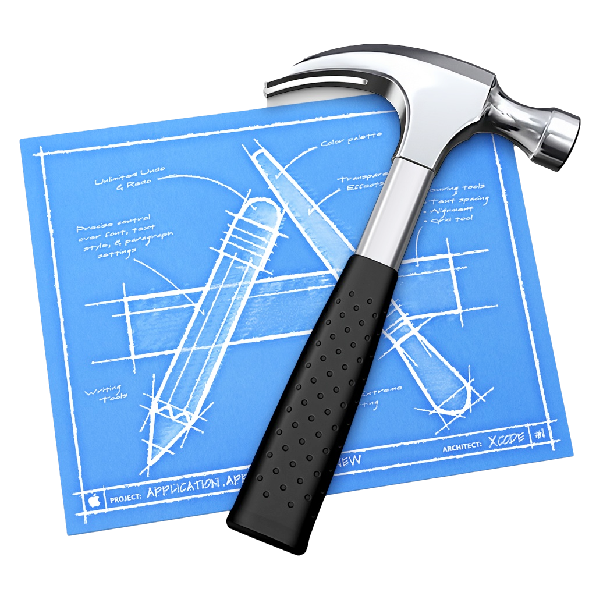
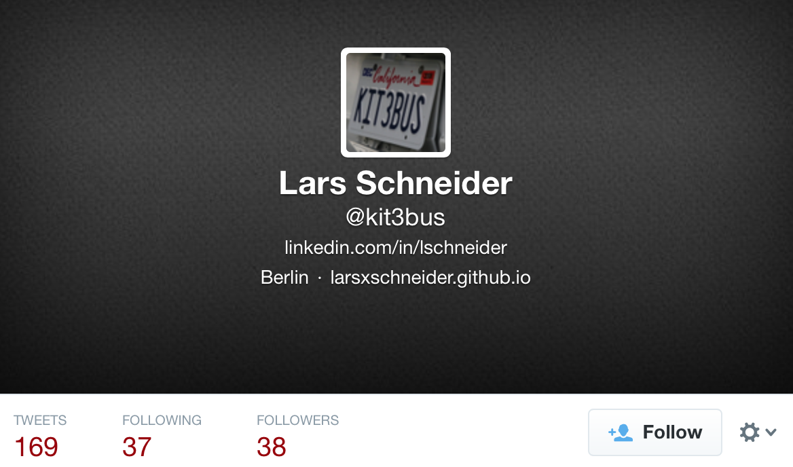

# Extending Xcode

## CocoaHeads Hamburg, April 2014

### Boris Bügling - @NeoNacho

---

---

# Agenda

- Xcode
- Using plugins
- Developing your own plugin

---

# AppCode?

.

---

# Xcode

---

Plugins!

---

# Possibilities

- Color Schemes
- File Templates
- Project Templates
- Plugins

---

# Using Plugins

---

## Alcatraz

The Xcode package manager

http://alcatraz.io

Marin and Delisa

---

opens

---

### How does it work?

- *packages.json* contains GitHub URL
- Clones the repository
- Runs *xcodebuild* with some parameters

---

# Some cool plugins

---

### ClangFormat

---

### FuzzyAutoComplete

---

### KSImageNamed

---

### OMColorSense

---

### ShowInGithub

---

### VVDocumenter-Xcode

---

### Xcode\_beginning\_of\_line

---

### XcodeColors

---

# Developing your own plugin

---

# Getting started

- Clone *https://github.com/kattrali/Xcode5-Plugin-Template*
- Put it into *~/Library/Developer/Xcode/Templates/Project Templates/Application Plug-in/Xcode5 Plugin.xctemplate*

---

---

# Plugin Template

- Xcode 5.1 compatible
- Shows a menu item
- On build, plugin ends up here: *~/Library/Application Support/Developer/Shared/Xcode/Plug-ins/*
- Just restart and it shows up

---

### Once you build and restart Xcode

.

---

---

https://github.com/neonichu/extending-xcode/

